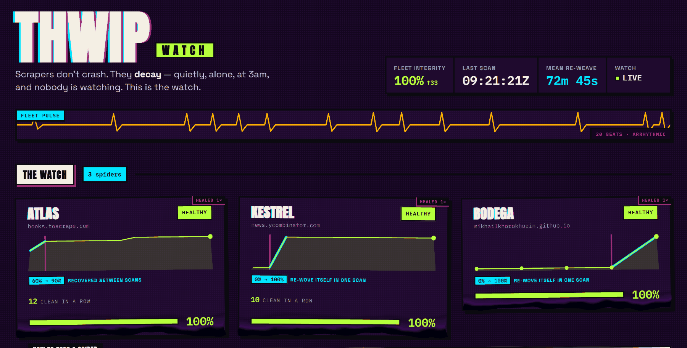
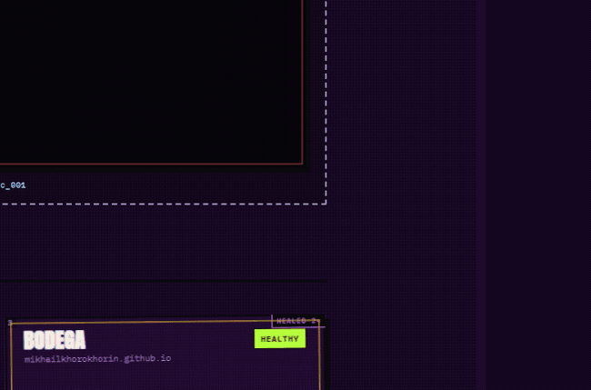

# THWIP

A self-healing watch console for web scrapers. Built for
[Into the Scrape-Verse](https://www.wemakedevs.org/hackathons/scrape-verse)
(WeMakeDevs × Bright Data).

**Live console → https://mikhailkhorokhorin.github.io/scrape-verse-hack/**



Scrapers do not crash. They decay — a target site changes, extraction starts returning
nulls and wrong values, and the pipeline stays green while the data quietly rots. THWIP
watches for that, shows it, and repairs it.



*Integrity loss renders as a substance covering exactly the percentage a Spider has lost.
Hold the pointer down and it tears away, showing the values underneath — the same data
the field chips read, not a caption written for the reveal.*

**Source repository → https://github.com/mikhailkhorokhorin/scrape-verse-hack**
(branches `main` and `develop`.)

## The four things a judge asks — answered here

| Question | Answer, in one line | Section |
|---|---|---|
| **How was the scraper designed?** | Three Bright Data Scraper Studio collectors, created with `bdata scraper create` from a plain-English field description; per-field validators live in `collectors.json` | [The collectors](#the-collectors) |
| **How is it driven from an agent?** | An MCP server with eight tools — status, history, incidents, heal receipts, evidence trails, a numbers audit, and two that scan and heal for real | [MCP server](#mcp-server--the-fleet-in-your-agent) |
| **What happened when the site changed?** | Four real breaks, two of them on sites we do not control, and one with no human in any phase. Each was healed on the same Collector ID, and each carries a per-field receipt of the value before and after | [It already caught a real one](#it-already-caught-a-real-one) |
| **What did the output actually give you?** | Real rows on screen, each stamped with the collector, the scan time, and the Integrity the Spider was at when the row was captured | [THE HAUL](#the-haul--the-data-itself) |

Full specs, the collector registry with every heal logged, and the eighteen-audit
checklist are in **[`docs/`](docs/README.md)**.

## The four questions, answered at length

The short answers are in the table above. These are the long ones.

### How the scraper was designed

Three collectors, built in Bright Data's **Scraper Studio** with `bdata scraper create` —
each one a target URL plus a plain-English description of the wanted fields. No selectors
were written by hand, and none was taken from Bright Data's pre-built library:

| Codename | Target | Collector ID | Fields |
|---|---|---|---|
| BODEGA | our own demo page | `c_mt2lkwxa1bb5uz223s` | title, price, rating, image |
| ATLAS | books.toscrape.com | `c_mt2fnqqngikv29od5` | title, price, rating, image, availability |
| KESTREL | news.ycombinator.com | `c_mt2fnt3p2k4n644701` | title, points, comments, author |

The `create` envelope for each is committed
([`docs/evidence/create-bodega.json`](docs/evidence/create-bodega.json),
[`create-atlas.json`](docs/evidence/create-atlas.json),
[`create-kestrel.json`](docs/evidence/create-kestrel.json)), and the registry with
creation dates and every heal since is [`docs/COLLECTORS.md`](docs/COLLECTORS.md).

### The platform and the product can disagree, and that is the point

Bright Data's own dashboard reports ATLAS at a **6.67% success rate** — 2,450 pages
attempted, 34,300 errors. Our console reports the same collector at **100% Integrity, 20
rows of 20 expected**, scan after scan. Both numbers are correct, and the gap between them
is the thesis of this project.

ATLAS is a discovery collector: it lands on the catalogue page, finds twenty books, and
then follows each product link. The platform counts every one of those fetches as a page,
so fourteen failed child fetches out of fifteen reads as 6.67% — one page in fifteen. But
every field we contracted for is already on the catalogue page, so all twenty rows come
back with a real title, price, rating and availability, and every one of them passes its
validator.

A platform-level success rate measures **how many requests completed**. Integrity measures
**how much of what you promised came back real**. A pipeline can be green while the data
rots, and — as here — it can look alarming while the data is perfect. That is exactly why
the number on this page is computed from the values themselves rather than inherited from
the fetch layer.


Scraper Studio decides *how* to extract. What counts as a **correct** value is ours, and it
is declared per field in `collectors.json` — `price` must parse as a number, `image` must be
an absolute URL, `rating` must fall in range. That split is what makes the rest of the
project possible: a field can be present, non-null, and still be reported broken.

### How it is driven from a coding agent

`mcp/` is an MCP server speaking JSON-RPC 2.0 over stdio, written straight against the
spec — **no SDK, no dependencies**. Eight tools. Six read the committed data and are free:
`fleet_status`, `spider_history`, `incident_log`, `heal_receipt`, `evidence_report`,
`numbers_audit`. Two call Bright Data and spend credit, and say so in the descriptions the
agent reads: `scan_fleet` and `heal_spider`.

```bash
claude mcp add thwip -- node mcp/server.js
```

The whole loop — *is anything broken? what broke? fix it. prove it* — runs as a
conversation. `heal_receipt` exists specifically for the last step: it prints every heal
phase with its timestamps beside the `collector_id` that did not change, and the per-field
before/after values, so the claim is one tool call rather than a file to go and read. Setup
and a worked transcript are in [`mcp/README.md`](mcp/README.md).

### What it did when the site changed under it

**Three breaks, all healed, all on the original Collector ID.** Two of them happened on
sites we do not control, which is the distinction that matters — a fixture page we can edit
proves nothing about a scraper surviving the real web:

| Incident | Spider | Site | Ours? | Strain | Integrity |
|---|---|---|---|---|---|
| `inc_001` | KESTREL | news.ycombinator.com | **no** | `RENAMED` | 0 → 100 |
| `inc_002` | ATLAS | books.toscrape.com | **no** | `DRIFTED` | 90 → 100 |
| `inc_003` | BODEGA | our demo page | yes | `THROTTLED` | 0 → 100 |

The console marks the first two **IN THE WILD** (`web/js/fleet/vitals/wild.js`) and says so on the page:
nobody staged them.

Each incident carries a per-field `verification` block naming the value received **before**
the heal and the value received **after** — not a pass/fail flag, the actual data:

- `inc_001` KESTREL `title`: `null` → `"Codex on AWS bedrock bug causing 10x charges"`;
  `points`: `null` → `62`; `author`: `null` → `"TheP1000"`
- `inc_002` ATLAS `availability`:
  `"In stock (19 available) In stock In stock In stock In stock In stock In stock"` →
  `"In stock"` — the field was never null. It was populated the whole time and wrong, which
  is the failure this project exists to catch
- `inc_003` BODEGA `price`: `null` → `"£18.00"`

That block is written by `scripts/verify.js` from a fresh run after the heal, not from the
heal's own report — a heal that claims success and still returns nulls is exactly the
silent failure being guarded against. It is rendered by `web/js/sheets/issue/receipt.js` and returned by
the `heal_receipt` MCP tool.

`inc_003` is kept even though the diagnosis was wrong: `repair.js` opened it autonomously
and called `THROTTLED`, but nothing on the target was broken — our own payload parser was.
The record keeps the false diagnosis and says so.

### What the structured output went on to power

**THE HAUL** is the section that answers this directly: the real scraped rows on screen,
card by card, each stamped with the collector that fetched it, the timestamp of the scan,
and the Integrity that Spider was at when the row was captured. Provenance travels with the
data. It is built from the `sample` on every record in `data/history.json` — committed
pipeline output, not a fixture.

The console itself is the other answer. Everything on the page is derived from the same two
JSON files: the Integrity scores, the 24h sparklines, the incident feed and its issue
covers, the mean time to recovery, the field heatmap, and the per-collector characters whose
legs are the expected fields and whose eyes are the Integrity band. There is no backend —
the scheduled pipeline is the backend, and the structured output is the database.

## It already caught a real one

Not a staged break. **Four are on the record, and two of them happened on sites we do not
control** — books.toscrape.com and news.ycombinator.com. All four are in
`data/incidents.json` with a per-field receipt of the value before and after the heal; the
long version is [above](#what-it-did-when-the-site-changed-under-it). Two are worth reading
first: the one below, and `inc_004`.

**`inc_004` — the one with no human in it.** On 22 Aug we committed a redesign of our own
demo page, moving the class names the way a real redesign moves them, and then touched
nothing. The cron saw Integrity fall to 50%, waited for a **second** consecutive bad scan
rather than reacting to one, opened the incident, diagnosed the strain as `RENAMED`,
re-wove the collector and verified against a fresh scrape — **11m 56s from detection to
verification**, `price: null → £18.00` and `rating: null → 4.4`, on an unchanged Collector
ID. Nobody ran a command, approved a repair, or edited a record.
Print the whole trail: `node tools/evidence-report.js inc_004`.

`KESTREL` scrapes the Hacker News front page. A scan came back with **30 rows and an
Integrity of 0**. Rows were being found, so from the outside nothing looked broken — but
the generated scraper had drifted onto its own invented keys, emitting `story_points` and
`comment_count` instead of the fields we contracted for, with **every value `0`**. No
titles, no authors. Thirty rows of confident nothing, and no error anywhere.

One command repaired it — `bdata scraper heal --auto-approve --auto-save`, unattended,
no human in the loop:

| | Before | After |
|---|---|---|
| **Collector ID** | `c_mt2fnt3p2k4n644701` | `c_mt2fnt3p2k4n644701` — **identical** |
| Integrity | 0 | 100 |
| Status | `CRITICAL` | `HEALTHY` |
| Rows | 30 | 30 |
| Fields | all four `dead` | all four `live` |
| Payload | `story_points` / `comment_count`, all `0` | real `title`, `points`, `author`, `comments` |

The Collector ID is the row that matters. **It did not change.** The collector was
repaired, not recreated — the same one that broke is the one that came back.

Check it yourself: the broken and healed payloads are committed as
[`docs/evidence/kestrel-probe.json`](docs/evidence/kestrel-probe.json)
and [`kestrel-after.json`](docs/evidence/kestrel-after.json), the scans are in
`data/history.json` (`04:43:39Z` and
`05:13:45Z` broken, `05:40:09Z` healed), and the heal is logged in
[`docs/COLLECTORS.md`](docs/COLLECTORS.md).

## Layout

### Why this code is clean

The judging phrase is "a repo a stranger could pick up on Monday". Here is what that
stranger inherits, counted from the tree rather than remembered:

| | |
|---|---|
| Tests | **1,152**, across 60 files in `test/{pipeline,web,mcp,tools}/` |
| Dependencies | **zero** — `dependencies` and `devDependencies` are both empty objects |
| Source files | 142 JS + 51 CSS, and **every one is ≤250 lines** — `max-lines` is an ESLint error, tests included |
| Comments | **zero, as policy** — `grep -c '^\s*//'` across `web/js`, `scripts` and `tools` returns 0 |
| Enforcement | ESLint and the full suite run in CI on every push |

Four decisions carry most of the weight:

- **Verification comes from a fresh run, never from the heal's own report.**
  `repair.js:heal` issues a separate `scraper run` after the re-weave and scores *that*
  payload with our own classifier; `verify.js` turns the two runs into a per-field
  verdict, and the incident closes only when the fresh run clears the threshold. A repair
  that reports success and delivers nothing leaves the incident open, which is the only
  arrangement an unattended system can be trusted on.
- **Data writes are append-only and atomic.** `scripts/lib/store.js` appends records and
  writes through a pid-scoped temp file, `fsync`s it and renames it into place — a cron
  killed mid-write cannot leave half a JSON file behind, and history is added to rather
  than edited, so a past diagnosis cannot be quietly improved after the fact.
- **The test harness runs browser globals in node with no bundler.** `test/web-loader.js`
  evaluates `web/js/*.js` inside a `vm` context and exposes its lexicals, so the console's
  plain global functions are unit-testable exactly as the browser loads them. No build
  step exists in this project, and none is needed to test it.
- **The grid reconciler is keyed by collector id.** Each cell carries `data-cid`;
  `reconcile.js` computes a pure plan and `reconcile-dom.js` applies only the cells whose
  generated HTML changed, so a 30-second refresh never tears down a panel a visitor is
  mid-gesture on.

One command checks all of it:

```bash
npm test && npx eslint . && node tools/numbers-audit.js
```


```
scripts/                    health-check and repair, Node
web/                        the console — no build step, no framework
  js/app.js                 the assembly point: load, adapt, render, poll
  js/data/                  config, shaping, the delta between two scans
  js/fleet/{grid,symbiote,rig,vitals,voice,scene}/
  js/sheets/{issue,haul,replay,front}/
  js/mock/                  the ?mock=1 fixtures and the Chaos Lab controls
  css/{base,fleet,sheets,fx,print,mock}/   the same anatomy, one level
  manual.html               the back page: install, tools, judge path
mcp/                        MCP server — the fleet, answering a coding agent
test/                       1,152 tests, node:test, no dependencies
  pipeline/                 scoring, classification, healing, verification
  web/                      mirrors web/js, folder for folder
  mcp/                      protocol, tools, injection resistance
  tools/                    the evidence report
data/                       history.json, incidents.json, committed by CI
demo-target/                the demo target — three variants of the same shop page
collectors.json             targets and per-field validators
docs/                       specs, the collector registry, the audit checklist
docs/evidence/              create envelopes and before/after payloads, as returned
.github/workflows/watch.yml scan every 30 min, heal, publish Pages
```

## Look at it first

The console is the product. Seeing it needs no account, no key and no credit:

```bash
git clone https://github.com/mikhailkhorokhorin/scrape-verse-hack.git
cd scrape-verse-hack
python3 -m http.server 8000          # any static server will do
```

Then open:

- **<http://localhost:8000/web/?mock=1>** — the full console with three Spiders and 48
  hours of synthetic history, including a break and a completed re-weave. Start here
- **<http://localhost:8000/web/>** — the real console, reading `data/*.json`. It shows
  honest empty states until the cron has committed a scan; it never falls back to
  synthetic data

It must be served over HTTP. Opening `web/index.html` from the filesystem shows an error
plate instead of the console — the page fetches its two JSON files, and browsers block
`fetch` on `file://` origins.

`?mock=1` also mounts a small control bar that can break a Spider and re-weave it on
demand, which is the fastest way to see the three field states and the symbiote move.
Add `?capture=1` to hide every control for a clean screenshot.

### What is on the page

The console is drawn as a comic page, and the drawing is the readout rather than decoration
beside it:

- **A character per collector.** One inline-SVG spider is authored once and parameterised
  (`web/js/fleet/rig/rig.js`, `rig-parts.js`). **Each expected field owns a mirrored pair of legs**, so
  a Spider at half Integrity is standing on half its legs, and **eight eyes light by
  Integrity band**. The same rig appears in the detail sheet with a named chip per field, so
  the leg-to-field mapping is stated explicitly where a judge would go to check it
- **It reacts to real events only.** The console re-fetches every 60s; one shared diff
  (`web/js/data/delta.js`, pinned by its own test file) compares the previous render to the new
  one. A Spider steps and turns when a record lands, `THWIP!` is reserved for records
  carrying `after_heal`, and speech bubbles fire on genuine field transitions — nothing
  speaks unless something changed
- **An opening sequence built from a real incident.** On first load the console replays
  `inc_003`, the BODEGA break, from the recorded data. `REPLAY INTRO` in the masthead runs
  it again
- **The incident feed is a shelf of comic-issue covers**, each with a hash permalink and a
  print stylesheet, so one incident can be linked or printed on its own
- **A diptych above the grid** — a healthy Spider and a taken one side by side, both picked
  out of real `history.json` records rather than two poses of the same drawing
- **An evidence line in the masthead** reading `data/meta.json`, whose test count is written
  by CI from the real TAP pass count. The number on screen cannot drift from the suite
- **THE HAUL** — the rows the fleet actually brought back, each stamped with its collector,
  scan time and the Integrity at capture

Smaller things that ship: sparkline hover with a keyboard route, caption-box section
headers, panel numbers, the page ground darkening as fleet health drops, print artefacts, a
favicon whose lit eye-band width is fleet Integrity, and an **IN THE WILD** note counting
the incidents that happened on sites we do not control.

Two ideas from that pass are not in the build and are listed so they stop being
reconsidered: the sparkline **crawler** was built, looked wrong, and was cut before it was
committed; the masthead **cover character** was rejected before any code, because the
tagline block carries the product thesis. The full brief set, with each brief's own status
line, is in [`docs/ideas/`](docs/ideas/).

**The manual.** The console is the product; the manual is its back page.
[`web/manual.html`](web/manual.html) — live at
<https://mikhailkhorokhorin.github.io/scrape-verse-hack/manual.html> — opens with the
newspaper ad the console used to carry: eight tools split six-free / two-paid, the
iron-clad guarantee, and a cut-out coupon whose three lines are the install. Its test
count is read from `data/meta.json` at page load, so it is right now rather than when it
was typed. Below it: the six-step judge path as numbered tickets, and the Chaos Lab
poster. The console keeps its sixth message slot as a one-panel teaser pointing here.

## Break it yourself (ten seconds, no install)

**https://mikhailkhorokhorin.github.io/scrape-verse-hack/?mock=1**

No clone, no keys, no backend — the fleet is synthetic fixtures, the mechanics are the
same code that runs the live watch.

1. **BREAK BODEGA** — Integrity falls 98% → 38%. The black climbs the panel, covering
   exactly what the scraper lost.
2. **Drag across the black** — it tears open. Under it are the values that actually came
   back: `price: null`, `rating: "undefined ⟵ literal text"`. That is the whole thesis:
   the scraper never crashed, it just went quietly wrong.
3. **RE-WEAVE** — the repair runs and prints a receipt: *2 of 2 broken fields re-checked
   against the run after the heal* — `null → $38.00`, `undefined → 4.6`, on an unchanged
   Collector ID.

**RESET** puts it back. Everything is keyboard reachable, and with
`prefers-reduced-motion` the scratch becomes a tap-toggle instead of a drag.

## The demo target — break the site for real

BODEGA scrapes a shop page we control, and that page ships in three variants so the break
does not have to be taken on trust. Switch between them from the header of the page
itself, or open them directly:

| Variant | URL | What the collector sees |
|---|---|---|
| **Healthy** | [`demo-target/`](https://mikhailkhorokhorin.github.io/scrape-verse-hack/demo-target/) | Every selector resolves. This is the contract BODEGA was built against |
| **Renamed** | [`demo-target/broken-renamed.html`](https://mikhailkhorokhorin.github.io/scrape-verse-hack/demo-target/broken-renamed.html) | A redesign moved the class names. `price` and `image` match nothing, `rating` moved into a data attribute — fields go **DEAD** |
| **Drifted** | [`demo-target/broken-drifted.html`](https://mikhailkhorokhorin.github.io/scrape-verse-hack/demo-target/broken-drifted.html) | Markup untouched, values rotted. Price is an em dash, rating is the literal string `"undefined"`, image is a placeholder — fields stay full and **LIE** |

The third one is the point of the whole project. Nothing is null, nothing throws, row
count is unchanged, and every value is wrong — the failure a green pipeline hides. Point
a scraper at `broken-drifted.html` and watch it succeed at collecting nothing.

All three are generated from one source of truth: `demo-target/build-data.js` holds the
12 products and the variant definitions, `build-page.js` renders them, and
`node demo-target/build.js` rewrites all three HTML files. Edit the data, not the markup.

## THE HAUL — the data itself

A health score is not an outcome. **The Haul** is the section that shows what the fleet
actually brought back — the real scraped rows, card by card, each stamped with the
collector that fetched it, the timestamp of the scan, and the Integrity the Spider was at
when that row was captured. Titles, prices, ratings and image URLs off
books.toscrape.com and the shop page; titles, points, authors and comment counts off
Hacker News.

It is built from the `sample` on every history record, so it is the committed data and not
a fixture — the same JSON the pipeline wrote. A row captured at 90% Integrity carries that
number, which is the point: provenance travels with the data. `web/js/data/haul-data.js`
resolves the rows, `haul-view.js` renders them.

## MCP server — the fleet, in your agent

The whole loop — *is anything broken? what broke? fix it. prove it* — also runs inside a
coding agent. `mcp/` is an MCP server speaking JSON-RPC 2.0 over stdio, implemented
straight against the spec with **no SDK and no dependencies**. Connect it in one line:

```bash
claude mcp add thwip -- node mcp/server.js
```

Cursor and any other MCP client work the same way — it is a plain stdio process
(`npm run mcp`). Full setup and a worked conversation are in
[`mcp/README.md`](mcp/README.md).

Eight tools. Six read the committed data — instant, free, no network:

| Tool | What it answers |
|---|---|
| `fleet_status` | How is every Spider right now — Integrity, status, which fields are live / infected / dead, how stale the scan is |
| `spider_history` | How has one Spider behaved over time, with post-heal runs marked |
| `incident_log` | What broke, and did the repair hold |
| `heal_receipt` | Prove one repair — every phase with timestamps and gaps, beside the `collector_id` that did not change |
| `evidence_report` | The whole trail for one incident: stage durations, per-field values on both sides, and SHA-256 digests recomputed from the committed files at call time |
| `numbers_audit` | Every number the console shows, recomputed from the committed JSON by a second implementation that shares no code with it |

Two drive Bright Data for real and **spend credit**: `scan_fleet` scrapes and scores the
fleet, `heal_spider` diagnoses, re-weaves, verifies and opens an incident. Their tool
descriptions say so in the text the agent reads, so a well-behaved agent asks first.

`heal_receipt` exists because the judged claim is that the Collector ID survives healing.
It prints the phases and the unchanged ID side by side, so the evidence is one tool call
away rather than a file to go and read.

## Running it for real

Only needed to produce new data. This calls Bright Data and costs credit:

```bash
npm i -g @brightdata/cli
bdata login                      # opens a browser, needs a human
node scripts/health-check.js     # one scan of every collector with an ID
node scripts/repair.js           # heals anything below 60% on two consecutive scans
```

`health-check.js` skips collectors that have no `collector_id` and exits 0, so it is safe
to run before anything is created. `repair.js` does nothing unless a collector has been
failing for two consecutive scans and is outside its 2-hour cooldown; force one with
`HEAL_COLLECTOR=c_xxx node scripts/repair.js`.

## Running the tests

1,152 tests, `node:test`, no dependencies and no test framework to install:

```bash
npm test
```

They cover the parts that decide whether the pipeline is telling the truth: field
classification and its exact boundaries, Integrity scoring, payload shapes, strain
diagnosis, the heal decision (two consecutive bad scans, 2-hour cooldown), atomic
JSON storage, and the MCP server's protocol handling and tool output. No network and no
`bdata` calls — the credit-spending paths run against a mocked `lib.bdata`, so the suite
runs offline in well under a second and never spends anything.

## CI

Everything runs on **GitHub Actions**, in `.github/workflows/watch.yml`:

| Job | When | What it does |
|---|---|---|
| `scan` | `*/30 * * * *` cron, or manually | `health-check.js`, then `repair.js`, then commits `data/` back |
| `build` | push to `main`, or the cron | Assembles `public/` from `web/`, `data/` and `demo-target/` |
| `deploy` | `main` only | Publishes to GitHub Pages |

**One secret, no second token** — Settings → Secrets and variables → Actions:

| Secret | What it is |
|---|---|
| `BRIGHTDATA_API_KEY` | Bright Data CLI auth |

The scan commits with the built-in `GITHUB_TOKEN`, which the workflow requests through
`permissions: contents: write`. Pages must be set to **Source: GitHub Actions**, not
"Deploy from a branch" — the workflow uploads the artifact itself.

The cron is in the file, so the schedule needs no setup in the UI. `concurrency: watch`
keeps two scans from writing `data/` at once. The `scan` job runs only on the cron or on
a manual dispatch, so pushing code never spends credit.

### Count the unattended record yourself

Every claim on this page is recomputable from the committed JSON and the git log. Three
commands, no install, no credentials:

```bash
git log --author="thwip watch" --oneline | wc -l   # commits no human made
node tools/numbers-audit.js                        # every number the console shows
npm test                                           # the whole suite, offline
```

As of this writing that is **25 bot commits** between 21 Aug 07:49 and 22 Aug 08:08 UTC,
**100 scans** over **2,074 rows**, **4 incidents** and **4 heals**, with `unchangedIds`
reading `true` — the collector IDs going into every repair are the IDs coming out. One of
those four, `inc_004`, had no human in any phase.

The bot commits are also readable in the browser, no clone required:
[commits by `thwip watch`](https://github.com/mikhailkhorokhorin/scrape-verse-hack/commits/main?author=thwip%20watch).

`tools/numbers-audit.js` is deliberately a second implementation. It re-derives the
figures from `data/*.json` without importing a line of the console's own code, so if the
page and the audit ever disagree, one of them is lying and you can see which.

## The collectors

Three real Bright Data Scraper Studio collectors, each created with a single
`bdata scraper create` call that describes the wanted fields in plain English — no
selectors written by hand:

```bash
bdata scraper create "https://<target>/" \
  "For each of the 12 product cards extract: the product title, the price including the
   currency symbol, the rating text such as 4.4 out of 5, and the absolute image URL." \
  --name thwip-bodega --pretty -o create-bodega.json
```

| Codename | Target | Collector ID | Why this site |
|---|---|---|---|
| BODEGA | our own demo page | `c_mt2lkwxa1bb5uz223s` | breakable on purpose, so the demo is reproducible |
| ATLAS | books.toscrape.com | `c_mt2fnqqngikv29od5` | no robots.txt, built for scraping, server-rendered |
| KESTREL | news.ycombinator.com | `c_mt2fnt3p2k4n644701` | real site; robots allows the front page, `Crawl-delay: 30` |

Scraper Studio decides *how* to extract. What counts as a **correct** value is ours, and
it is declared per field in `collectors.json` — a `price` must parse as a number, an
`image` must be an absolute URL, a `rating` must fall in range. That validator list is
what turns a run into an Integrity score, and it is why a field can be present and still
be reported as broken.

The full `create` envelopes are committed under
[`docs/evidence/`](docs/evidence/) as `create-atlas.json`, `create-kestrel.json`
and `create-bodega.json`. Each target was verified as public, login-free, robots-checked
and outside Bright Data's pre-built scraper library — do not substitute one.

**These IDs do not change when a collector heals.** That is the point of the self-healing
loop and the thing worth checking: the same collector that broke is the one that came
back, repaired rather than replaced. The KESTREL heal at the top of this file is the
worked example — same `c_mt2fnt3p2k4n644701` before and after. Every heal is logged
against its ID in [`docs/COLLECTORS.md`](docs/COLLECTORS.md), with creation dates.

## What is not finished

Stated plainly rather than left for you to find:

- **The automated repair path is now proven end to end — it was not, until 22 Aug.** Two
  of the four heals (`inc_001` KESTREL, `inc_002` ATLAS) were invoked by hand. `inc_003`
  was opened autonomously but its heal fixed nothing, because nothing on the target had
  broken; the watcher's own payload parser was at fault, and the record keeps that false
  `THROTTLED` diagnosis rather than tidying it away. `inc_004` is the one that closes the
  gap: detection, diagnosis, re-weave, verification and closure all ran unattended, and
  the field values came back real. Two of four are still hand-invoked, and this line says
  so
- **A wrong diagnosis is in the log on purpose.** See `inc_003` above and
  [`docs/COLLECTORS.md`](docs/COLLECTORS.md), which states the provenance of each record.
  Manufacturing cleaner evidence is precisely the failure this project exists to expose
- **MTTR is a mean of four samples.** `renderMttr()` averages `closed_at − opened_at`
  across `data/incidents.json`. Four heals is enough to display honestly and not enough
  to be a trend. It reads `--` when there are none
- **`REWEAVING` is a state the console can render and nothing writes.** `repair.js` runs
  to completion inside one CI job, so no mid-heal record is ever persisted. The branch in
  `web/js/data/adapter.js` is reachable only from mock data
- **The phone pass has not been run.** The responsive contract is specified in
  `docs/DESIGN-SPEC.md` and the layout collapses to a single column, but nobody has walked
  the console at 375px since the character rig landed. It is the one item on the UI list
  that can reject work already done, and it is still open

## The data

Two committed JSON files, no database:

| File | What is in it |
|---|---|
| `data/history.json` | One record per collector per scan: field states, Integrity, status, row count and the first row as a sample. Capped at 2000 records |
| `data/incidents.json` | One record per heal: what broke, the strain, the prompt sent to Scraper Studio, what came back, and the four stage timestamps |

Both are written by the scheduled pipeline and read directly by the console. The full
field-by-field contract is in [`docs/CLAUDE.md`](docs/CLAUDE.md).

## Architecture

Four moving parts, one of which is the product. There is no backend: the scheduled
pipeline *is* the backend, and two committed JSON files are the database.

```
GitHub Actions — .github/workflows/watch.yml (cron */30, every 30 min)
  └─> scripts/health-check.js
        ├─ bdata scraper run <c_*> <url> --pretty
        ├─ classify every field on every row: live / infected / dead
        ├─ Integrity = (live + 0.5 x infected) / expected x 100
        └─ append to data/history.json
              │
              ├─ if Integrity < 60 on two consecutive scans
              │     └─> scripts/repair.js
              │           ├─ bdata scraper heal ... --auto-approve --auto-save --timeout 900
              │           ├─ re-run and verify rather than trust the heal
              │           └─ append to data/incidents.json
              │
              └─> web/ (static console, fetches both JSON files)
```

Infection is weighted at half credit on purpose. A field returning garbage is worse than
a correct one and better than nothing — nothing at least fails loudly.

## The three field states

The reason this project exists. A scraper that breaks does not crash; it keeps returning
rows, and the rows go quietly wrong.

| State | Meaning | Why it matters |
|---|---|---|
| `LIVE` | Present and passes its validator | Working |
| `INFECTED` | Present and wrong — `"undefined"`, a placeholder URL, a rating out of range | **Passes every null check.** This is the failure a green pipeline hides |
| `DEAD` | `null`, `""`, or `[]` | At least it is obvious |

## How self-healing works

1. A scan drops below 60% Integrity. One bad scan is not enough — a single failure is
   usually transient, and healing on it burns credit for nothing
2. A second consecutive bad scan opens an incident, stamped `DETECTED`
3. `repair.js` classifies the **strain** of the break from the field states, then builds a
   heal prompt from the fields that actually broke — never from scraped content, which
   would be an injection into the healer

   | Strain | What it means |
   |---|---|
   | `THROTTLED` | every field came back empty — the request was blocked or redirected |
   | `RENAMED` | a selector moved; the rest of the page still extracts |
   | `DRIFTED` | values keep arriving and keep being wrong — the selectors match the wrong nodes |
   | `SHIFTED` | the columns slid — a field returned a value belonging to its neighbour |

   The strain goes into the prompt with a one-line rationale, because _"a selector moved
   and the rest of the page still extracts correctly"_ gets a better fix out of Scraper
   Studio than _"price is null"_. It is also printed on the incident card, so the
   diagnosis is visible rather than buried in a log
4. `bdata scraper heal --auto-approve --auto-save` re-derives the selectors. The Collector
   ID does not change, which is the point: the same collector survives the break
5. The result is **verified with a fresh run**, not trusted. A heal that reports success
   and still returns nulls is exactly the silent failure this product is about
6. The incident closes with `VERIFIED` and the recovery is appended to history, so the
   sparkline shows it without waiting for the next scheduled scan

A 2-hour cooldown per collector prevents a heal loop against a site that is simply down.

### The one that actually ran

Steps 4 through 6 above are not theory. On KESTREL, `heal` ran the full chain unattended
— `planner → code_fixer → step_preview_runner → request_fulfillment_validator →
css_selector_extractor → user_approval → save_new_template` — in roughly **9 minutes**,
with `--auto-approve --auto-save` and nobody watching. A verification run afterwards
returned 30 rows carrying real titles, points, comments and authors where every field had
been `null`, on the same Collector ID. Full log in
[`docs/COLLECTORS.md`](docs/COLLECTORS.md).

### What happens when the heal itself lies

A self-healing scraper is only as trustworthy as the thing that decides the heal worked.
If the repair reports its own success, the system is a rubber stamp. So THWIP never asks.
After every re-weave it runs a **fresh scrape** and scores what actually comes back, field
by field, against the validators in `collectors.json`. The incident closes only if that
fresh run clears the HEALTHY threshold. Four things can come back, and only one of them
closes anything.

**The heal returns nothing.** Every field is null again. The verdict is
`NOTHING_CAME_BACK`, integrity is unchanged, and `resolved` stays `false` — the incident
is still open, still visible on the console, still counted against us. A heal that
silently produced no data cannot mark itself done.
`node --test test/pipeline/heal-that-lies.test.js`

**The heal returns garbage that looks like data.** This is the failure mode that defeats
a schema check: a price that reads back as the string `undefined`, a rating of `9000`.
Both are populated. Both would pass "is the field present?". Both are caught here, because
every field carries a rule — `rating` is `{ type: "number", min: 0, max: 5 }` — and a
value that fails its rule is scored `INFECTED`, worth half credit, not full. Integrity
lands below the resolve bar and the incident stays open. ATLAS's real incident is this
shape caught one step earlier — `availability` populated on every scan and wrong on every
scan: `node tools/evidence-report.js inc_002`

**The heal fixes some of it.** One field of two comes back. The verdict is `PARTIAL`, the
receipt names which field returned and which is still failing, and `resolved` is still
`false`. A partial repair is a real improvement and it is still not a closed incident; the
ledger says both things at once rather than rounding up.
`node --test test/pipeline/verify.test.js`

**The heal actually works.** Every broken field comes back live, integrity clears the
threshold, the verdict is `EVERY_FIELD_BACK`, and only now does `resolved` flip to `true`.
The receipt keeps the value each field held on both sides, so the claim is checkable
rather than asserted. BODEGA's overnight incident is the worked example:
`node tools/evidence-report.js inc_003`

The design difference is worth stating plainly, because there is an obvious alternative:
**gate the approve** — inspect the proposed repair and reject it before it ships. That is
a good pattern when a human is watching, because judging a borderline fix needs taste: is
this selector brittle, is this value plausible for this site. THWIP runs unattended on a
30-minute cron with nobody in the loop, and a gate with no human behind it is just a
second guess stacked on the first. So we do not gate the approve. **We let the heal ship,
then verify from reality and refuse to close.** The cost is an honest window where a
collector is repaired but not yet confirmed. The benefit is that no number on this page
can be wrong in our favour: every `resolved: true` in the ledger is backed by a scrape
that happened after the repair and returned data that passed its validators.

The four cases above are the four stories in `test/pipeline/heal-that-lies.test.js`. They build
real rows, push them through the same scoring code the cron uses, and assert the verdict
and the `resolved` flag that fall out.

**One command prints the full evidence trail.** `node tools/evidence-report.js` (or
`inc_001` for one incident, `--json` for machine reading) prints, per incident: the
`collector_id` before and after the repair — asserted identical, and the tool fails loudly
if it ever is not — the stage timestamps with the duration between each, a per-field table
of state and value on both sides of the heal, the verification verdict, and SHA-256
digests of the incident record and of every committed payload file behind it. The digests
are recomputed from disk at call time, so they are a check, not a claim. The same report
is available to an agent as the `evidence_report` MCP tool.

## Roadmap

**None of the following is built.** They are listed because they are the honest next
steps, not because they exist.

- **Quarantine** — an infected Spider detaches itself from downstream consumers, so bad
  rows stop flowing while the re-weave runs. The natural sequel to blast radius
- **Field contracts** — subscribe to a field rather than to a scraper: *wake me if the
  `price` fill rate drops below 95%*
- **Transferable cures** — a heal prompt that worked on one site is offered for a similar
  break on another. A fleet that learns
- **Pre-emptive healing** — fingerprint the target's DOM and detect drift before fields
  start failing
- **Cost per clean row** — what one correct row actually costs, counting runs and heals

## Documentation

Everything that shaped this build is in **[`docs/`](docs/README.md)**. The three worth
opening:

- [`docs/COLLECTORS.md`](docs/COLLECTORS.md) — the collector registry: every `c_*` with
  its creation date and a dated log of every heal it survived
- [`docs/DESIGN-SPEC.md`](docs/DESIGN-SPEC.md) — the visual contract the console was
  built against, including the banned-patterns list that rules out the generic dashboard
- [`docs/AUDIT-PIPELINE.md`](docs/AUDIT-PIPELINE.md) — eighteen audits with a pass bar
  each, run before submitting

If you are a coding agent, start at [`docs/CLAUDE.md`](docs/CLAUDE.md) — it puts you in
autonomous mode — then take the first unchecked item in
[`docs/PROGRESS.md`](docs/PROGRESS.md) and work down the queue.

## Deploying the console anywhere

The `build` job in `.github/workflows/watch.yml` assembles the site, but the same bundle
can be built by hand in one command — useful if CI runners are unavailable:

```bash
mkdir -p public && cp -r web/* public/ && cp -r data public/ && cp -r demo-target public/
```

`public/` is then a self-contained static site: no build step, no server-side code, and
the console reads `data/history.json` and `data/incidents.json` relative to itself. Drop
it on any static host. To check it locally before publishing:

```bash
cd public && python -m http.server 8080
```

Serve `public/`, not `web/` — the console fetches `data/` as a sibling, which is how the
deployed layout is arranged.

## Rules

- Real `bdata` calls, never mocked. A judge checks the Collector ID
- `create` takes 5-25 minutes and `heal` up to 15, and both cost credit. **Never recreate a
  collector that already has an ID** in [`docs/COLLECTORS.md`](docs/COLLECTORS.md) — if
  `run` fails, `heal` it
- Run `npm test` before changing anything in `scripts/` — the suite is the contract
  between what the pipeline writes and what the console reads
- No secrets in the repo, in CI logs, or in any frame of the demo video
