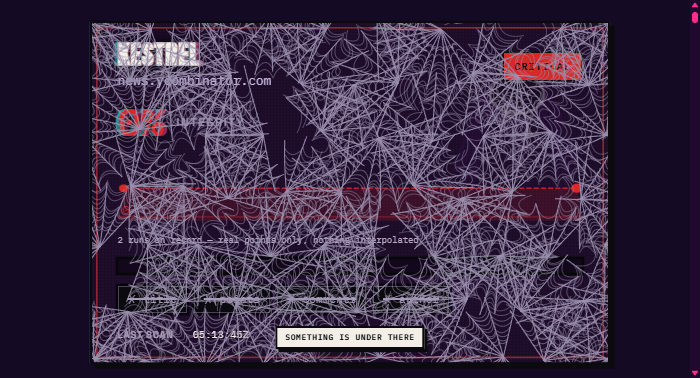
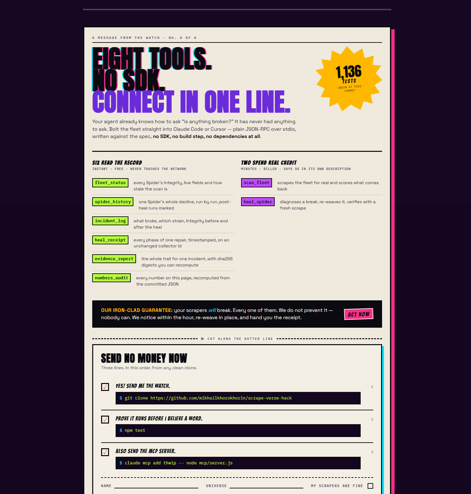
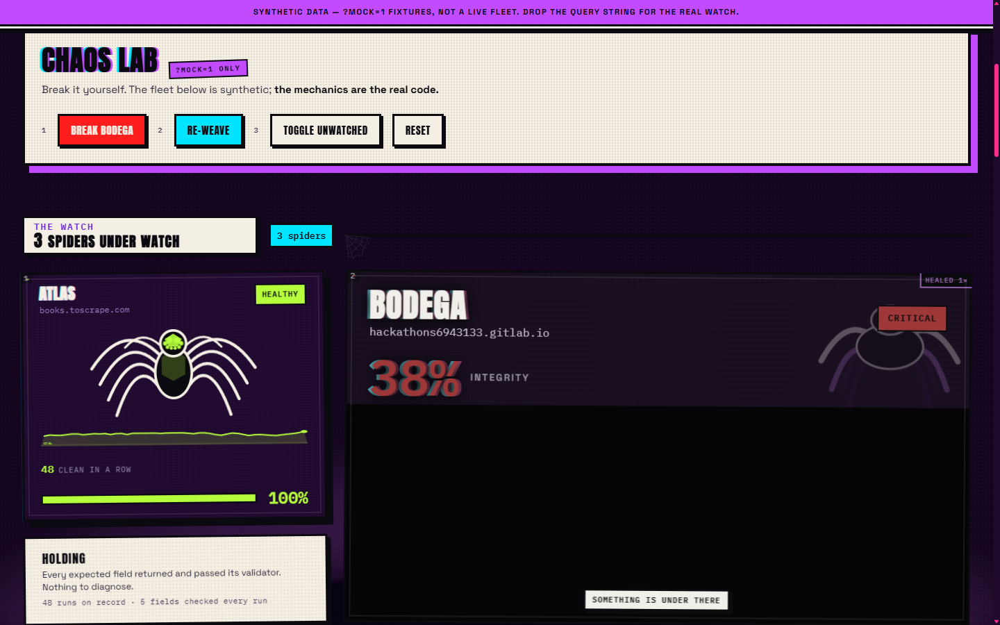

# THWIP — a self-healing scraper watch

Scrapers do not crash. They **decay** — a site changes a class name, extraction starts
returning nulls and wrong values, and the pipeline stays green while the data quietly
rots. THWIP is the thing that notices, shows you exactly what was lost, repairs the
collector in place, and writes down the proof.

Built for [Into the Scrape-Verse](https://www.wemakedevs.org/hackathons/scrape-verse),
WeMakeDevs × Bright Data, 17–23 Aug 2026.

**Live console → <https://mikhailkhorokhorin.github.io/scrape-verse-hack/>**

**The manual → [`/manual.html`](https://mikhailkhorokhorin.github.io/scrape-verse-hack/manual.html)**

**Demo video → `<VIDEO>`**

Every scraper is a Spider with an **Integrity** score, 0–100: how much of what it
promised came back real. When Integrity drops, a web spins over its panel covering
exactly the share that was lost — and you drag the threads away, one whole strand at a
time, to read the values that actually arrived.


---

## Judge it in ten minutes

Nothing below needs an API key, touches the network, or spends a credit.

| # | Do this | It proves |
|---|---|---|
| 1 | Open the [live console](https://mikhailkhorokhorin.github.io/scrape-verse-hack/) | Three real collectors, four recorded incidents, the data they returned |
| 2 | Drag the web off the broken half of the **diptych** near the top | The reveal is the same data the field chips read, not a caption |
| 3 | Open [`?mock=1`](https://mikhailkhorokhorin.github.io/scrape-verse-hack/?mock=1), press **BREAK BODEGA**, then **RE-WEAVE** | The break→heal→receipt loop, in your browser, in ten seconds |
| 4 | `git clone` this repo, then `npm test` | 1,455 tests, `node:test`, zero dependencies, offline |
| 5 | `node tools/evidence-report.js inc_004` | The full trail of the incident **no human touched**, with SHA-256 digests |
| 6 | `git log --author="thwip watch" --oneline \| wc -l` | Commits authored by the workflow, not by a person |

---

## The scrapers, built in Scraper Studio

Three collectors, each created with `bdata scraper create` against a site the Bright Data
pre-built library does not cover. No Scrapers Library entry is used anywhere in this
project.

| Codename | Target | Collector ID | Fields under contract | Why this site |
|---|---|---|---|---|
| **ATLAS** | books.toscrape.com | `c_mt5mpgolbgqeg9ziv` | title, price, rating, image_url, availability | A sandbox built for scraping; no robots.txt, server-rendered. Rating lives in a **CSS class**, not in text — the natural infected-field candidate |
| **KESTREL** | news.ycombinator.com | `c_mt5mpiem10zvo4kkwj` | title, points, comments, author | A real site with real churn. `robots.txt` allows the front page; `Crawl-delay: 30` is respected |
| **BODEGA** | our own demo page | `c_mt5mo9mkz9u25zefn` | title, price, rating, image | Breakable on purpose, so a judge can reproduce a break without waiting for the web to move |

Every ID is pinned in [`collectors.json`](collectors.json) with its per-field validators.
The creation envelopes Bright Data returned are committed verbatim in
[`evidence/`](evidence/).

**All three targets are public.** No login wall, no paywall, no personal data, no
government site. `robots.txt` was read for each before a single request; the reasoning
per target is in the table above.

---

## What comes back

One real row, exactly as ATLAS returned it and as it is committed in
[`data/history.json`](data/history.json):

```json
{
  "title": "Libertarianism for Beginners",
  "price": { "value": 51.33, "currency": "GBP", "symbol": "£" },
  "rating": "Two",
  "image_url": "https://books.toscrape.com/media/cache/91/a4/91a46253e165d144ef5938f2d456b88f.jpg",
  "availability": "In stock"
}
```

That shape is the contract. A `price` must parse as a number, an `image_url` must be an
absolute URL, a `rating` must fall in range — declared per field in `collectors.json` and
checked on every scan. **A field that arrives populated but wrong is scored `INFECTED` at
half credit**, which is the failure mode a null check cannot see and the reason Integrity
exists at all.

The console shows those rows as themselves under **THE HAUL**, each stamped with the
collector that fetched it, when it was scanned, and the Integrity that Spider was at when
the row was captured. Provenance travels with the data.



*A Spider that lost everything. The web covers exactly the share of the contract that
did not come back — drag the threads away and the nulls underneath are readable.*

---

## Where AI helped, and where it did not

I used **Claude Code (Anthropic)** throughout, which is also how Bright Data intends
Scraper Studio to be driven: the whole `bdata` workflow runs inside a coding agent, in
the terminal, with no dashboard.

It helped me most with **ideas and with parts of the code** — sketching approaches,
drafting the pipeline scripts, writing large stretches of the test suite, and arguing back
when a design was weak. It did not build the project on its own.

The **console front-end I built by hand**: the comic layout, the web that buries a broken
panel, the tear-away reveal, the character rig, the diptych and the whole visual system
came from me
rather than from a prompt. So did the decisions that make the rest of it worth anything —
which sites I chose to target and why, the Integrity model and its three field states, my
rule that a repair waits for two consecutive bad scans, my rule that verification runs a
fresh scrape instead of trusting the heal's own report, and my choice to leave a wrong
diagnosis on the record rather than tidy it away.

---

## Self-healing — four real breaks, one with nobody watching

Judges were told to look for `bdata scraper heal`. Here is every time it ran, on the
record, with the Collector ID identical on both sides:

| Incident | Spider | Strain | Integrity | Site is ours? | Opened by |
|---|---|---|---|---|---|
| `inc_001` | KESTREL | `RENAMED` | 0 → 100 | **no** — news.ycombinator.com | hand |
| `inc_002` | ATLAS | `DRIFTED` | 90 → 100 | **no** — books.toscrape.com | hand |
| `inc_003` | BODEGA | `THROTTLED` | 0 → 100 | yes | the cron, unattended |
| `inc_004` | BODEGA | `RENAMED` | 50 → 100 | yes | **the cron, and no phase was human** |

**Two of the four happened on sites we do not control.** Most self-healing demos break a
fixture they wrote themselves; half of our evidence is somebody else's HTML changing
under us.

**`inc_004` is the one to check.** On 22 Aug we committed a redesign of our own demo page
— the class names moved, the way a real redesign moves them — and then touched nothing.
The cron saw Integrity fall to 50%, **waited for a second consecutive bad scan** rather
than reacting to one, opened the incident, diagnosed the strain as `RENAMED`, re-wove the
collector, and verified against a fresh scrape. **11m 56s from detection to verification**,
`price: null → £18.00` and `rating: null → 4.4`, on an unchanged Collector ID. Nobody ran
a command, approved a repair, or edited a record.

```bash
node tools/evidence-report.js inc_004
```

That prints the collector id on both sides (asserted identical), the four stage
timestamps with computed durations, the value every field held before and after, the
verdict, and SHA-256 digests **recomputed from the committed files at call time** — a
check, not a claim.

### What stops a heal from lying

A repair that reports success but returns nothing, or returns confident garbage, is the
obvious way to fake this. It cannot close an incident here:

- verification is computed from a **fresh scrape run after the heal**, never from the
  heal's own report — `scripts/verify.js`;
- `scripts/repair.js` sets `resolved` only when that fresh run clears the healthy
  threshold, so a heal that returns nothing leaves the incident **open**;
- values that come back populated but wrong are caught by the per-field validators and
  score `INFECTED`, which keeps Integrity below the threshold and the incident open.

Four cases are pinned as tests you can read as prose:
`node --test test/pipeline/heal-that-lies.test.js` — all nulls, populated garbage,
partial recovery, real recovery.

### One heal did not work, and we kept it

`inc_003` was opened autonomously by the cron overnight, and the heal it fired **fixed
nothing** — because nothing on the target had broken. The scraper was returning one
wrapped row holding a products array, and our own payload parser was scoring the envelope
instead of the rows. The bug was ours.

The wrong diagnosis is still in `data/incidents.json`, written exactly as the system
believed it at the time. A monitoring tool that quietly rewrites its own history to look
smarter is precisely the thing this project exists to catch; it does not get an exemption
for being ours.


*The proof a re-weave writes: every broken field re-checked against a fresh scrape after
the heal, with the value before and after, on an unchanged collector id.*

---

## The Collector ID as a production endpoint

The cron in [`.github/workflows/watch.yml`](.github/workflows/watch.yml) runs every 30
minutes, scans all three collectors, scores every field, opens and heals incidents on its
own, commits the results, and republishes the site. Nothing is manual.

```bash
git log --author="thwip watch" --oneline | wc -l   # commits no human made
node tools/numbers-audit.js                        # every number the console shows
```

When this paragraph was written that printed **28 bot commits** since 21 Aug 07:49,
**109 scans** over **2,260 rows**, **4 incidents** and **4 heals**, with `unchangedIds`
reading `true`. The first three will be larger when you run it, because the cron has not
stopped — which is the point of quoting the commands rather than the totals.

`tools/numbers-audit.js` is deliberately a **second implementation**: it recomputes every
figure from the committed JSON and shares no code with the console, so a disagreement
between them would show rather than hide.

---

## Drive it from your coding agent

Eight tools over stdio JSON-RPC, written straight against the MCP spec: no SDK, no build
step, no dependencies. Six read the committed record and are instant, free, and never
touch the network. Two spend Bright Data credit and say so in their own descriptions, so
a well-behaved agent asks before it bills you.



*[`/manual.html`](https://mikhailkhorokhorin.github.io/scrape-verse-hack/manual.html) —
the console's back page. The test count on it is read from `data/meta.json` at page load.*

```bash
claude mcp add thwip -- node mcp/server.js
```

Then ask the fleet the questions you would ask a colleague: *is anything broken? what
broke? fix it. prove it.*

| Free — reads the committed record | Spends Bright Data credit |
|---|---|
| `fleet_status` · `spider_history` · `incident_log` | `scan_fleet` — scrapes the fleet for real |
| `heal_receipt` · `evidence_report` · `numbers_audit` | `heal_spider` — diagnoses, re-weaves, verifies |

**→ [`mcp/README.md`](mcp/README.md)** has the protocol notes, every tool schema, and a
verbatim transcript of the receipt for the incident no human touched.

---

## Run it yourself

```bash
git clone https://github.com/mikhailkhorokhorin/scrape-verse-hack.git
cd scrape-verse-hack
npm test                                  # 1,455 tests, zero dependencies, offline
python3 -m http.server 8000               # any static server
```



*`?mock=1` — the CHAOS LAB. Press BREAK BODEGA and the web spins over the panel;
RE-WEAVE heals it and prints the receipt shown further up.*

Then open <http://localhost:8000/web/> — the console reads two committed JSON files and
needs no backend. Add `?mock=1` for the CHAOS LAB, where the fleet is synthetic and says
so, but the break, the spread and the receipt are the same code the live page runs.

To scan for real you need a Bright Data account and `bdata login`; `npm run health` and
`npm run repair` are the two entry points the cron itself uses. **Everything above this
line works without a key.**

---

## Layout

```
scripts/       the product: scan, score, diagnose, heal, verify
  health-check.js   one scan of every collector, scored field by field
  repair.js         opens an incident after two consecutive bad scans, heals, closes
  verify.js         scores a fresh run after the heal — never the heal's own report
web/           the console — no build step, no framework, no dependencies
  js/{data,fleet,sheets,mock}/    modules named for the part of the product they build
  css/{base,fleet,sheets,fx,print,mock}/
  manual.html                    the back page: the pitch, the tools, the judge path
mcp/           MCP server — eight tools, stdio JSON-RPC, no SDK
tools/         evidence-report.js and numbers-audit.js — proof, computed twice
test/          1,455 tests in {pipeline,web,mcp,tools}/, mirroring the source tree
data/          history.json and incidents.json, committed by CI on every scan
evidence/      raw Bright Data payloads; the digests are recomputed from these
collectors.json   targets, Collector IDs, per-field validators
demo-target/   the shop page BODEGA watches — three variants of the same page
```

No dependencies and no devDependencies: `npm install` installs nothing, and CI asserts
that it stays that way. Every JS and CSS file is **≤250 lines**, enforced as an ESLint
error and re-checked in CI, tests included.

---

## How Integrity is computed

Per scan, per field, from what actually came back:

| State | Meaning | Credit |
|---|---|---|
| `LIVE` | arrived and passed its validator | full |
| `INFECTED` | arrived and is **wrong** — out of range, wrong type, a literal `"undefined"` | half |
| `DEAD` | null, empty, or missing | none |

Integrity is the share of the promised contract that came back real, so a scraper
returning thirty rows of confident zeros scores 0 and not 100. **This is the whole
argument**: a pipeline can be green while its data rots, and only a per-field score
against a declared contract can see it.

A worked example lives on the live page: Bright Data's own dashboard reports ATLAS at a
**6.67% success rate** while our console reports **100% Integrity, 20 rows of 20**. Both
are right. ATLAS follows each product link, so the platform counts fourteen failed child
fetches per catalogue page — but every contracted field is already on the catalogue page,
so every row comes back complete. A platform success rate measures how many requests
completed; Integrity measures how much of what you promised came back real.

---

## Honest limitations

Stated plainly rather than left for a judge to find:

- **Two of four heals were invoked by hand** (`inc_001`, `inc_002`). `inc_004` closes the
  gap end to end, unattended, but two of four is two of four.
- **MTTR is a mean of four samples.** Enough to display honestly, not enough to be a trend.
- **`REWEAVING` is a state the console can render and nothing writes** — `repair.js` runs
  to completion inside one CI job, so no mid-heal record is ever persisted. The branch is
  reachable only from mock data.
- **The scratch has no keyboard affordance**, by design: it is a pointer-only reveal over
  data that is *also* readable as text chips on the same panel. Nothing is behind it that
  is not elsewhere.
- **Frame rate was measured on a contended machine.** The console holds ~82fps in three
  consecutive runs with all animation live, but that number deserves a quiet browser
  before anyone quotes it.

---

## Rules this project holds itself to

- **Public data only.** No login wall, no paywall, no personal data, no government site.
- **Never recreate a collector that has an ID.** If a run fails, `heal` it — a needless
  recreate costs credit and breaks everything downstream that trusted the ID.
- **Never commit a key.** `.env`, `credentials.json` and `config.json` are gitignored, and
  no key appears in this repository, in the console, or in the demo video.
- **Never edit a record to look better.** `inc_003`'s wrong diagnosis stays.

MIT licensed.
